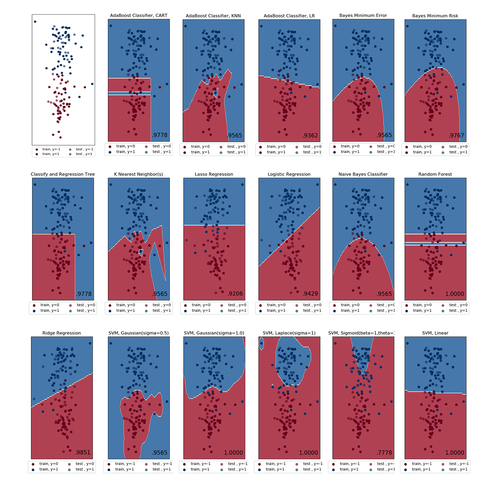
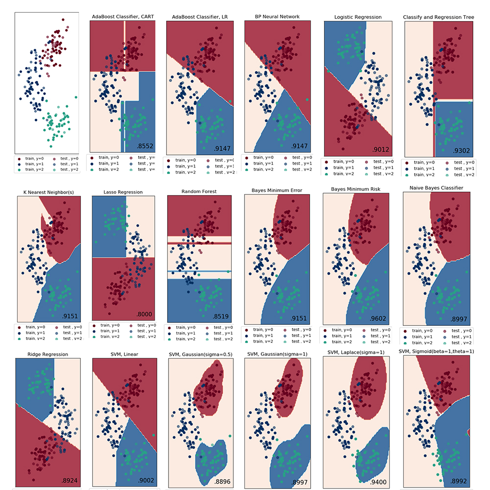

<center>

</center>


Simple Meachine Learning

一个简单的机器学习算法实现

 [](https://travis-ci.org/Yangruipis/simple_ml) [](https://www.codacy.com/app/Yangruipis/simpleML?utm_source=github.com&amp;utm_medium=referral&amp;utm_content=Yangruipis/simpleML&amp;utm_campaign=Badge_Grade) [](https://gitter.im/simple_ml/Lobby?utm_source=badge&utm_medium=badge&utm_campaign=pr-badge&utm_content=badge) 

---


# 快速开始

## 安装

**环境和依赖库**
- python3.5及以上
- windows or Linux
- numpy
- matplotlib
- scipy
- requests

`强烈推荐Anaconda环境`

**终端安装**

```bash
git clone https://github.com/Yangruipis/simple_ml.git
cd ./simple_ml
python setup.py install
```

## 使用

```python
# 一个简单的例子，用CART树进行二分类
from simple_ml.tree import CART
import numpy as np

X = np.array([[1,1.1],
              [1,2.0],
              [0,3.0],
              [0,2.2]])
y = np.array([1,1,0,0])
cart = CART(min_samples_leaf=1)
cart.fit(X, y)
x_test = np.array([[1,2],[3,4]])
print(cart.predict(x_test))
```
```python
Out[1]: np.array([1,1])
```

- `./simple_ml/examples`文件夹中提供了大多数方法的使用范例
- 更详细的用法见帮助文档： [https://yangruipis.github.io/simple_ml/](https://yangruipis.github.io/simple_ml/)

# 它能做什么

## 最最最最主要的任务

如果你同时满足：
1. **机器学习入门阶段**
2. **python 进阶阶段**

那么恭喜你，这个项目可以给你提供如下帮助：

- **阅读源码**， 不像sklearn过于复杂难读的源码，这个轻量级的项目非常易读，并且我尽可能的增加了注释，提高代码的可读性
- **学习知识**，该项目梳理基本机器学习算法的种类和流程，工程实现上的大致步骤，中间出现的一些细节问题以及如何解决
- **实时交流**，我在 gitter 上建立了 [gitchat 聊天室](https://gitter.im/simple_ml/Lobby?utm_source=badge&utm_medium=badge&utm_campaign=pr-badge&utm_content=badge)，欢迎大家就项目本身的具体问题，或者其他任何相关事项进行讨论，欢迎大家积极提 issues，我会第一时间回复


## 作为一个机器学习项目的任务

### 1. 数据和特征

#### 1.1 数据集获取

`simple_ml`提供了大量经典的机器学习数据集的获取接口`DataCollector`，数据集来自[UCI](http://archive.ics.uci.edu/ml/index.php)。

#### 1.2 数据预处理

`simple_ml` 提供了常用的数据预处理方法，包括了编码、独热编码、缺失值处理、异常值处理以及随机数据集划分等。

同时，`simple_ml` 提供了`PCA`降维方法以及针对高维数据的`SuperPCA`降维方法。

#### 1.3 特征选择
`simple_ml`提供了Filter和Embedded两种特征选择方法，包括了：
1. 方差法
2. 相关系数法
3. 卡方检验法
4. L1正则
5. GBDT特征选择

### 2. 模型

#### 2.1 二分类
`simple_ml`提供了非常多的二分类方法，以[wine数据集](http://archive.ics.uci.edu/ml/datasets/Wine)为例（见`./simple_ml/examples`），分类效果和方法名称见图1。

<center>


图 1. 二分类效果图
</center>

#### 2.2 多分类

`simple_ml`暂时只提供了一些多分类算法，见下图，同样是[wine数据集](http://archive.ics.uci.edu/ml/datasets/Wine)，后面作者将会进行补充。

<center>


图 2. 多分类效果图
</center>


#### 2.3 回归

`simple_ml`提供了`CART`、`GBDT`这两种回归方法，后面将加入`SVR`


#### 2.4 聚类

`simple_ml`提供了`K-means聚类`和`层次聚类`两种聚类方法

`注:`以上所有图均为simple_ml直出（需要matplotlib）

### 3. 效果评价


# 为什么会有这个项目 & 致谢

作者就读于上海某商科院校经济学，从大二开始接触数据挖掘，以及编程相关知识（stata->R->C#->python)，对数据和编程非常感兴趣，基本上一路走过来全靠自学。作者希望可以用心做好一个项目，记录自己学习的轨迹，尤其是即将毕业之际。

在接下来的一年找工作的同时，作者将尽全力维护该项目，不断更新和修改，热烈欢迎任何贡献和讨论。

**致谢：**
- 首先感谢我自己，一路走来的不易如人饮水
- 其次感谢我的好友[何燕杰](https://github.com/YanjieHe)和[程刚](https://github.com/chenggang0815)对我在学习和工作上的帮助
- 最后感谢所有相关书籍、博客的作者，尤其感谢[刘建平Pinard](https://www.cnblogs.com/pinard/)一丝不苟的机器学习博客，无论是知识还是态度，都令人肃然起敬


# 更新日志

- 2018-04-20
  - 加入BP神经网络算法`simple.neural_network`和相关的example
  - 更新github pages

# TODO list:

- [ ] test cases
- [x] an efficient bp network
- [ ] more optimal methods
- [x] train test split func in helper
- [x] other feature select method to add
- [x] lasso and Ridge
- [x] add GBDT feature select
- [x] update Readme
- [x] setup.py
- [x] examples
- [x] get more datasets
- [ ] regression plot
- [ ] kd_tree
- [ ] Support Machine Regression
- [ ] more metrics
- [x] github pages, especially the class map